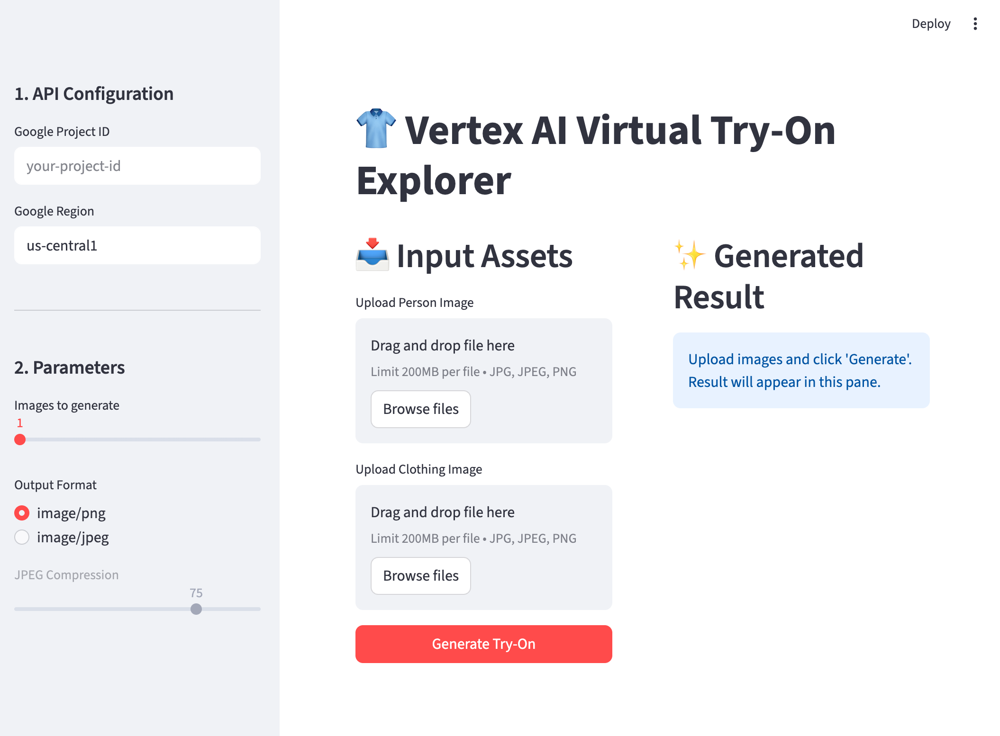

# Google - Vertex virtual Try On Demo

[Google Vertex AI docs](https://docs.cloud.google.com/vertex-ai/generative-ai/docs/image/generate-virtual-try-on-images)

Takes a Person image and Clothing image and generates a shot of the person wearing the clothing item.

## Prerequisites

Python 12+

## Run the app

1. Activate your virtualenv (if you have one)   
   From the project root (vertex-virtual-try-on-demo)

- macOS/Linux:   
  `source venv/bin/activate`
- Windows (PowerShell):   
  `venv\Scripts\Activate.ps1`

2. Install dependencies (once per environment)    
  `pip install -r requirements.txt`

3. Run the Streamlit app   
   `streamlit run app.py`

4. Open in browser    
   Streamlit will print a local URL, typically [http://localhost:8501](http://localhost:8501). Open that in your browser to use the app.

You need to configure your Google propject ID and Region.

